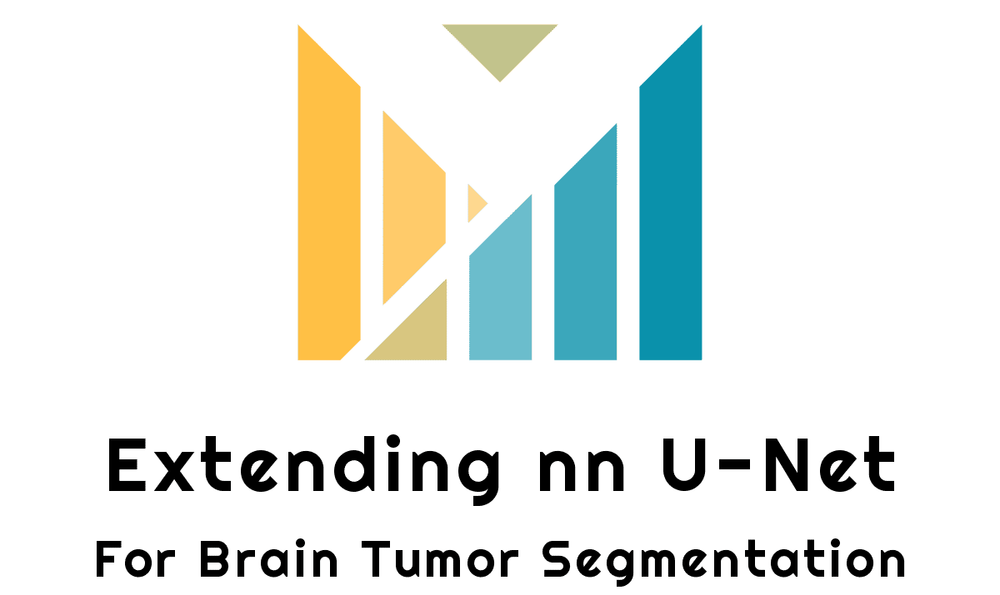
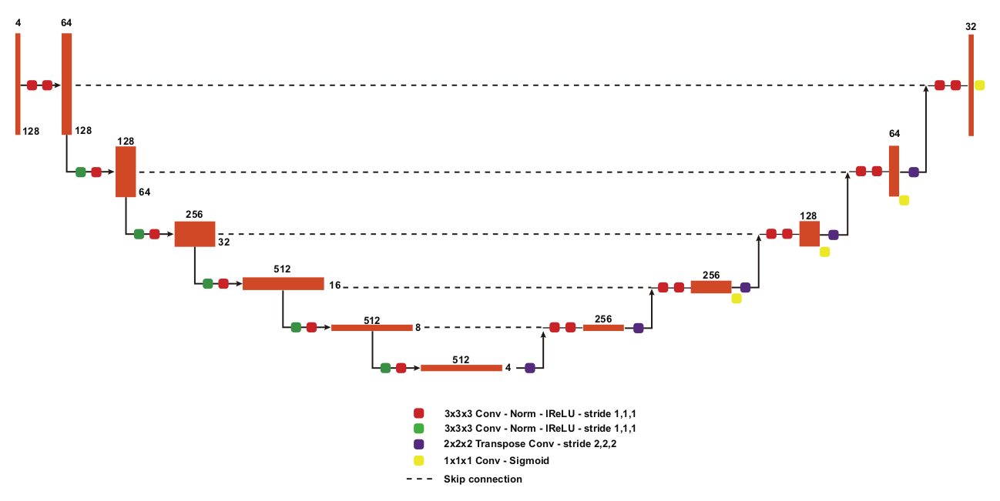

## About
This repository is the implementation of **Extending nn U-Net** paper.
* Paper abstract: [Go to link](https://arxiv.org/abs/2112.04653v1)
* PapersWithCode: [Go to link](https://paperswithcode.com/paper/extending-nn-unet-for-brain-tumor)

## Authors:
* Paper:
    * [Huan Minh Luu](mailto:luuminhhuan@kaist.ac.kr)
    * [Sung-Hong Park](mailto:sunghongpark@kaist.ac.kr)
* Codebase:
    * [Milad Sadeghi DM](https://elns.ir)
    * List of [all contributors](https://github.com/EverLookNeverSee/Extending_nn_U_Net/graphs/contributors) to this repository.

## License
This project licensed under the MIT License - see the [LICENSE](LICENSE) file for more details.
